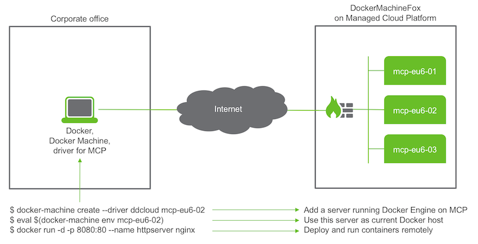

# Setup of your environment

Docker Machine provides a unified experience of running containers across multiple cloud platforms. On this page we focus specifically on the [Managed Cloud Platform from Dimension Data](http://cloud.dimensiondata.com/eu/en/). As a software developer, you may want to handle containers at shared or at on-premises cloud facilities provided by Dimension Data. Follow instructions below and learn how to harness the power of containers, right from your laptop.

As a starting point, the diagram below puts Docker, Docker Machine and Docker Engine in context.

