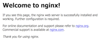

# Docker Machine with Dimension Data cloud services

Docker Machine provides a unified experience of running containers across multiple cloud platforms. On this page we focus specifically on the [Managed Cloud Platform from Dimension Data](http://cloud.dimensiondata.com/). As a software developer, you may want to handle containers at shared or at on-premises cloud facilities provided by Dimension Data. Follow instructions below and learn how to harness the power of containers, right from your laptop.

As a starting point, the diagram below puts Docker, Docker Machine and Docker Engine in context.


[Docker](https://www.docker.com/) and [Docker Machine](https://docs.docker.com/machine/overview/) are sitting at the development workstation. Docker Machine is a tool that lets you install [Docker Engine](https://www.docker.com/products/docker-engine) on virtual hosts, and manage the hosts with `docker-machine` commands. You can use Machine to create Docker hosts on your local Mac or Windows workstation, on your company network, in your data center, or on cloud providers like AWS or Dimension Data. In other terms, Docker Machine allows software engineers to handle containers almost anywhere on Earth.

Docker Machine interact with any [Managed Cloud Platform](http://cloud.dimensiondata.com/), be it a public, hosted or on-premises cloud facilities delivered by Dimension Data or by a partner of the One Cloud alliance.

## From CloudControl to Docker Machine

The consumption of Docker containers on the Managed Cloud Platform requires following elements:
* a working Docker and Docker Machine environment
* the addition of the Docker Machine driver from Dimension Data
* MCP credentials

In other terms, if you have already used the CloudControl web interface, then you are fully eligible to consume Docker containers as well, right from your workstation.

## How to install Docker Machine?

The Docker Machine executable can be downloaded and installed directly. For example on macOS and on Linux run following command:

```shell
$ curl -L https://github.com/docker/machine/releases/download/v0.8.2/docker-machine-`uname -s`-`uname -m` >/usr/local/bin/docker-machine
$ chmod +x /usr/local/bin/docker-machine
```

For workstations with Windows or any other operating system, you can download the latest release of Docker Machine from https://github.com/docker/machine/releases

As an alternative, on macOS and on Windows, Docker Machine is coming along with other Docker products when you install the Docker Toolbox. For details, check [the download page for Docker Toolbox](https://www.docker.com/products/docker-toolbox) first, then look either at [macOS installation instructions](https://docs.docker.com/toolbox/toolbox_install_mac/) or [Windows installation instructions](https://docs.docker.com/toolbox/toolbox_install_windows/).

Whatever option you consider, you can quickly check the installation of Docker Machine with following command:

```
$ docker-machine –v
```

Add [the Docker Machine driver from Dimension Data](https://github.com/DimensionDataResearch/docker-machine-driver-ddcloud/releases) and place the executable in the same directory as `docker-machine` executable (or somewhere on your `PATH`).

Set your MCP credentials in the environment, and the initial password for hosts as well.

On Windows there are multiple ways to set variables. You can do this by running the following in powershell:

```powershell
[Environment]::SetEnvironmentVariable("MCP_USER", "<your-name>", "Process")
[Environment]::SetEnvironmentVariable("MCP_PASSWORD", "<your-password>", "Process")
[Environment]::SetEnvironmentVariable("MCP_SSH_BOOTSTRAP_PASSWORD", "<root-password>", "Process")
```

Alternatively, open the Configuration Panel and look for System settings. Then add system environment variables
``MCP_USER``, ``MCP_PASSWORD`` and ``MCP_SSH_BOOTSTRAP_PASSWORD`` and save your changes.

In case you do not have access to system settings of your computer, you can still
set variables temporarily in a Command Prompt session:

```
C:\>set MCP_USER=<your-name>
C:\>set MCP_PASSWORD=<your-password>
C:\>set MCP_SSH_BOOTSTRAP_PASSWORD=<root-password>
```

On macOS and Linux you should edit variables for your own user profile:

```
$ nano ~/.bash_profile
```

Insert lines with your secrets:

```
# credentials for Docker Machine driver
export MCP_USER="<your-name>"
export MCP_PASSWORD='<your-password>'
export MCP_SSH_BOOTSTRAP_PASSWORD="<root-password>"
```

Save the file with `Ctrl-O`, confirm, then exit with `Ctrl-X`.

## Select data centers for your containers

Where do you want to deploy containers? The global network of Managed Cloud Platforms is structured in independent regions. And every region has multiple data centers so that you can architect fault-tolerant systems. In most cases you will consider the data centers that are as close as possible from end-users, and limit network latency. Where data placement is important, select a Managed Cloud Platform in a suitable country, or contract with Dimension Data to add one.

After the selection of a Managed Cloud Platform, you prepare a virtual data centre with the CloudControl web console. A virtual data centre consists at least of: a Network Domain, a VLAN, and appropriate firewall rules.

The below is an example configuration sheet that you can adapt to your own needs.

Managed Cloud Platform:
* EU6 (in Frankfurt, Germany)
* in region EU (the nick name for Europe)

Network Domain:
* name: DockerMachineFox
* type: Essentials

VLAN:
* name: DockerMachineNetwork
* subnet: 10.77.88.0/24

Firewall rule to accept Docker traffic:
* name: DockerInbound
* protocol: TCP over IPv4
* from: any host, any port
* to: any host, port 2376

Firewall rule to accept SSH traffic:
* name: SshInbound
* protocol: TCP over IPv4
* from: any host, any port
* to: any host, port 22

Firewall rule to accept HTTP traffic:
* name: HttpInbound
* protocol: TCP over IPv4
* from: any host, any port
* to: any host, port 80

Firewall rule to accept HTTPS traffic:
* name: HttpsInbound
* protocol: TCP over IPv4
* from: any host, any port
* to: any host, port 443

Firewall rule to accept HTTP proxy traffic:
* name: HttpProxyInbound
* protocol: TCP over IPv4
* from: any host, any port
* to: any host, port 8080

If your containers accept other protocols over the internet then you will create additional rules accordingly.

## How to create a host with Docker Machine?

Use the command `docker-machine create` with appropriate parameters, and indicate the name of the new host. The sample command below creates the machine `mcp-eu-01` at EU6 on macOS or on Linux:

```bash
$ docker-machine create --driver ddcloud \
    --ddcloud-region EU \
    --ddcloud-datacenter EU6 \
    --ddcloud-networkdomain 'DockerMachineFox' \
    --ddcloud-vlan 'DockerMachineNetwork' \
    --ddcloud-ssh-key ~/.ssh/id_rsa \
    mcp-eu6-01
```

On Windows just remove the backslashes so the whole command is on a single line.

```
> docker-machine create --driver ddcloud --ddcloud-region EU  --ddcloud-datacenter EU6 --ddcloud-networkdomain 'DockerMachineFox'  --ddcloud-vlan 'DockerMachineNetwork' --ddcloud-ssh-key ~/.ssh/id_rsa mcp-eu6-01
```
You can check the IP address of the new host, and locate security artifacts, with following command.

```bash
docker-machine config mcp-eu6-01
```

The output should be similar to this:

```bash
--tlsverify
--tlscacert="/Users/bernard/.docker/machine/certs/ca.pem"
--tlscert="/Users/bernard/.docker/machine/certs/cert.pem"
--tlskey="/Users/bernard/.docker/machine/certs/key.pem"
-H=tcp://168.128.13.169:2376
```

Now that you have one host up and running you can activate it with following command on macOS or Linux:

```bash
$ eval $(docker-machine env mcp-eu6-01)
```

On Windows you may have to use following command instead:

```
>@FOR /f "tokens=*" %i IN ('docker-machine env mcp-eu6-01') DO @%i
```

As an example, let's try running the official Nginx container:

```
docker run -d -p 8080:80 --name httpserver nginx
```

In this command, port 80 in the Nginx container is mapped to port 8080 on the host. This is meaning that we can access the default Nginx page from anywhere. Open the link in a web browser, using the IP address given by the `config` command.

```
http://168.128.13.169:8080
```



Congratulations! At this stage you have created a host and deployed a container, all from your workstation.

## How to stop, start, or restart a host?

At the Managed Cloud Platform a stopped server costs far less than a running server. Therefore, a good practice is to stop unused
hosts when possible.

```
docker-machine stop mcp-eu6-01
```
You can start a host when you want using the following command.

```
docker-machine start mcp-eu6-01
```

If for some reason you have to restart a host, use the following command.

```
docker-machine restart mcp-eu6-01
```

## How to handle multiple hosts?

Since it is so easy to create remote hosts with Docker Machine, you can quickly end up with several hosts.
The list of hosts is shown with following command.

```
docker-machine ls
```

The output should be similar to this:

```
NAME         ACTIVE   DRIVER    STATE     URL                         SWARM   DOCKER    ERRORS
mcp-eu6-01   *        ddcloud   Running   tcp://168.128.13.168:2376           v1.12.3
mcp-eu6-02   -        ddcloud   Running   tcp://168.128.13.169:2376           v1.12.3
```

In this example, two hosts are available and `mcp-eu6-01` is currently active. This is meaning that all `docker` commands are executed there.
You can switch to another host with a command like this on macOS and Linux:

```bash
$ eval $(docker-machine env mcp-eu6-02)
```

And on Windows:

```
>@FOR /f "tokens=*" %i IN ('docker-machine env mcp-eu6-02') DO @%i
```

## How to execute commands on the host?

Hosts created by Docker Machine are running Linux, so you can login directly:

```
docker-machine ssh mcp-eu6-02
```

Command prompt now reflects the fact that you're logged into the host as root:

```shell
root@mcp-eu6-02:~#
```

Type the combination `Ctrl-D` to exit the SSH session.

Note that you can also run a command remotely for example.

```
docker-machine ssh mcp-eu6-01 apt-get update
```

Not sure what kernel your remote Docker host is using? Type the following:

```
docker-machine ssh mcp-eu6-01 uname -r
```

## How to remove a host?

After this command all resources attached to the host will be lost, including permanent storage:

```
docker-machine rm mcp-eu6-01
```
